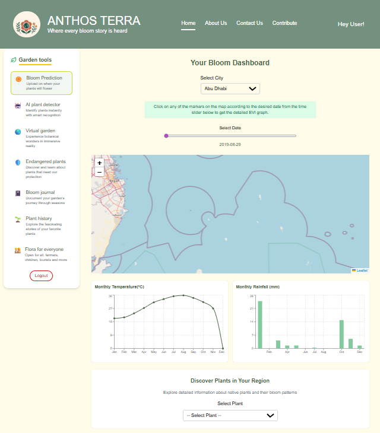
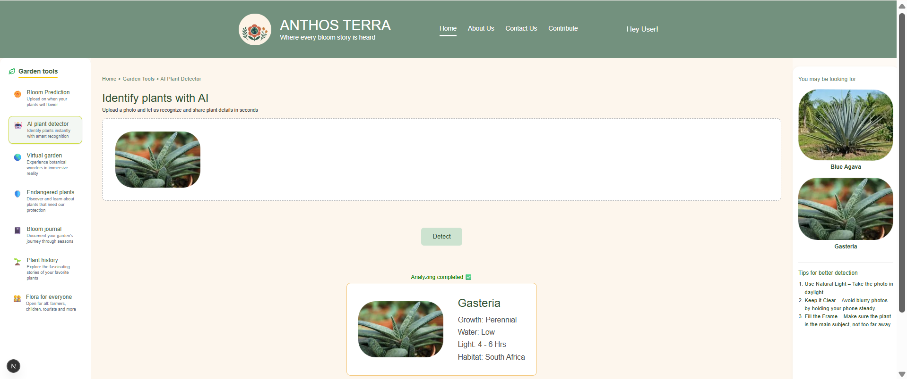

# 🏆 2025 NASA Space Apps Global Nominee & Honorable Mention
 

## 🌱 **Anthos-Terra**: Web-based Plant Bloom Visualization & Prediction Platform

## 🌍 The Challenge

**Witness the pulse of life across our planet.**  
From season to season and year to year, Earth’s vegetation is constantly changing. These changes provide critical insights into plant species, agricultural cycles, seasonal effects, pollen sources, and plant phenology—the relationship between climate patterns and biological processes in plants.

The challenge is to harness the power of **NASA Earth observations** to create a **dynamic visual tool** that can display and/or detect **plant blooming events** across the globe—much like pollinators naturally do.
 

## 📝 **Description**
Anthos-Terra is a web-based platform for **monitoring, analyzing, and forecasting plant blooming events** using NASA Earth observation data and other open datasets. Focused on sensors such as MODIS (MOD13A1), Landsat, UAESTATS, and VIIRS, the system ingests NDVI and related vegetation indices for interactive mapping and trend analysis of bloom activity.
 

## 🔍 How Does It Work?

Anthos Terra functions as a comprehensive platform that merges **environmental monitoring**, **plant detection**, and **immersive visualization** to explore the rhythms of Earth’s vegetation. The system integrates three core modules that work together to deliver a complete and engaging experience.

### 🌿 Environmental Analysis & Bloom Prediction

The platform analyzes multiple environmental indicators—**NDVI**, **EVI**, **rainfall**, and **temperature**—to monitor vegetation health and forecast blooming events. These datasets, sourced from satellite observations and climate archives, are processed to identify correlations between vegetation growth and environmental conditions.

A **rule-based prediction system** determines bloom likelihood using defined threshold conditions. For example, an NDVI value above 0.3, combined with moderate rainfall and an optimal temperature range, indicates a higher probability of blooming.

For this prototype, the model focuses on **_Tribulus omanense_**, a native desert plant species in Abu Dhabi. This localized approach enables targeted bloom prediction, trend visualization, and region-specific ecological insights.

  
   
  <em>Bloom Prediction</em>

### 🤖 AI-Assisted Plant Detector

The AI-assisted Plant Detector allows users to identify plant species through **image-based input**. Users can upload a photo of a plant, and the system compares its visual features against a curated reference database.

The output includes:
- Identified plant name  
- Growth characteristics  
- Water and light requirements  
- Habitat information  

This module connects plant identification with environmental context, helping users understand which conditions favor specific species. While currently lightweight, the detector is designed to scale with larger plant datasets or satellite-based vegetation classification models in future iterations.

  
   
  <em>AI Plant Detector</em>

### 🕶️ Immersive Virtual Reality Visualization

The Plant Blooms VR experience places users inside a **color-coded 3D environment** representing vegetation activity. Floating pink particles symbolize bloom events, while subtle motion effects simulate natural blooming dynamics, creating an ambient and immersive landscape.

Rather than relying solely on charts or maps, this module transforms environmental data into a **living digital ecosystem**, allowing users to intuitively explore bloom distribution and intensity.

The VR module is currently under development and will be enhanced with:
- Real satellite-derived bloom predictions  
- Dynamic environmental overlays  
- Temporal and spatial bloom simulations  

This creative fusion of **data visualization, environmental science, and digital art** enables users to experience ecological change in a more personal, sensory, and intuitive way.

  
   
  <em>Virtual Reality</em>

## ✨ **Features**

- 💾 **Integration with MODIS (MOD13A1), Landsat, UAESTATS, and VIIRS datasets**
- 📈 **Automated NDVI extraction**, regional aggregation, and multi-source fusion.
- 🗺️ **Interactive region selection** and vegetation filtering,
- 📊 **Time-series visualization** for bloom cycles/intensity.
- 🟩 **Geospatial mapping** of bloom activity and phenology.
- 🔮 **Bloom & pollen production panel** powered by ML prediction.
- 🌐 **API endpoints** for data, forecast, and map overlays,

## 🏗️ **Architecture**

### 🎨 **Frontend**
**Framework & Language** : Next.js + React — TypeScript, client-server components 
**UI / Visualization**: Plotly, Recharts and Nivo; plain CSS + PostCSS (Tailwind-style classes used).
**Geospatial Mapping**: Leaflet.js
**Client CSV parsing**: PapaParse (browser).
**Prediction logic (client-side)**: TypeScript simple linear regression.

### ⚙️ **Backend / API**
Next.js API routes (Node.js).

**Data format**: CSV data

**Build / Package**: Node.js + npm 

**Dev tooling**: TypeScript, ESLint, PostCSS; Next.js dev tooling / bundler (webpack).
 

### 🌍 **Data Sources**
- **NASA Earth Observatory Global Maps (MODIS NDVI)**
- **NASA POWER DAV**, **NASA Worldview Application**
- **MODIS MOD13A1 (NDVI/EVI)**, **Landsat (NDVI)**
- **UAESTATS**, **VIIRS**

### 🚀 **Hosting & Development**
- ⚡ **Deployment:** To be hosted
- 🔗 **Version Control:** GitHub for repo & collaboration

### 🗄️ **Storage**
- ☁️ Cloud storage/local disk for raw and processed data
 

## 🚀 Our Project

## 🖥️ Presentation
  

## 🎥 Watch the Project Video
[Watch the video](https://www.canva.com/design/DAG09koVuBk/pSuW2xI3wdQgzrhwN41DBA/edit)
 

